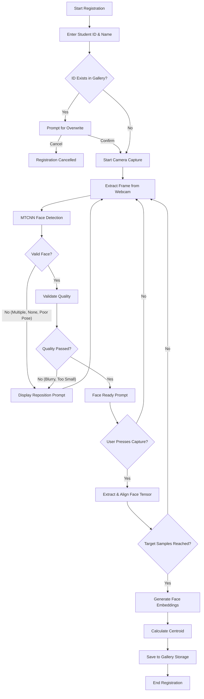

# Registration Module Review Documentation

## 1. Flowchart of the Registration Process

## 2. Information Stored in the Gallery

For each registered student, the gallery persists the following data:
- **`gallery.json`**: Acts as the central metadata registry mapping `student_id` to their information:
  - `name`: Full name of the student.
  - `num_samples`: The number of capture samples collected during registration.
- **`embeddings.npy`**: A numpy array of shape `(num_samples, 512)` containing the L2-normalized deep feature embeddings for every captured face sample.
- **`centroid.npy`**: A numpy array of shape `(512,)` containing the mean L2-normalized representation of the student's face, used for fast recognition matching.

## 3. Registration Failure Cases & Handling

- **Duplicate Student IDs**: The system detects if a student ID already exists and prompts the user to either explicitly overwrite the existing data or cancel the process, preventing accidental data loss.
- **No Face Detected**: If MTCNN cannot detect a face, the UI warns the user to reposition and disables capture until a face is found.
- **Multiple Faces Detected**: The system rejects the frame to prevent capturing the wrong person's features.
- **Poor Face Quality (Blurry or Too Small)**: Frames failing variance checks (blur) or dimension limits are rejected with a specific warning on the HUD.
- **Poor Pose (Side Profile)**: Landmark analysis enforces frontal poses. Non-frontal alignments are rejected.
- **Cancellation**: If the user presses 'Q' during capture, the process aborts gracefully without writing incomplete data to the storage.

## 4. Current Status: Completed vs Pending

### Completed
- End-to-end CLI flow for student registration.
- Guided UI (HUD) for multi-angle sample capture (Frontal, Left, Right, etc.).
- Robust MTCNN face extraction and validation (pose, blur, bounds, multiple faces).
- Stable gallery storage mechanism with embedding generation and centroid calculation.
- Automated tests covering validation, integrity, duplicate handling, and cancellation.

### Still Pending
- Integration of the gallery with the live Recognition module for real-time attendance.
- Advanced liveness detection (anti-spoofing) to prevent photo/video replay attacks during registration.
- GUI Dashboard (currently operates entirely via CLI).
